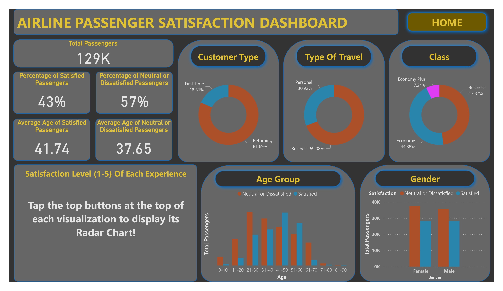

# Dano-Airline-Passanger-Satisfaction-Dashboard

## Introduction
This PowerBI project aims to boost customer satisfaction for **Dano Airlines** by analyzing feedback from over 120,000 passengers. The goal is to identify key areas for improvement and devise a data-driven strategy, presented in a concise report or dashboard.

**_Disclaimer_**: _All Datasets report do not represent any company, institution, or country, but just a practice dataset to demonstrate the capabilities of PowerBi._

## Problem Statement
1. Identify the key factors that influence customer satisfaction for Dano Airlines.
2. Determine the total number of passengers and the proportion of passengers who are satisfied, neutral, or dissatisfied.
3. Analyze the average age of passengers who are satisfied and dissatisfied.
4. Understand the distribution of different Customer Types, Types of Travel, and Class.
6. Represent the distribution of satisfaction levels across different genders.
7. Analyze the satisfaction levels across different age groups and genders. Determine which age groups and genders have higher satisfaction rates.

## Skills Demonstrated
- DAX
- New Measures
- Bookmarks
- Filters
- Tooltips
- Buttons
- Modeling

## Modeling:
This model is a single-table schema.
The dataset consists of one table that contains all the necessary information about the passengers, their flight details, and their satisfaction levels. This table serves as the primary source of data, containing all the necessary information in one place without the need for additional tables or links between them. This makes the data easier to manage and query while still providing a comprehensive view of the factors affecting customer satisfaction for Dano Airlines.

## Visualization

The dashboard contains the following:

1. Passenger Demographics: Analyze the total number of passengers, their average age, and the distribution across customer types, types of travel, and classes.

2. Satisfaction Levels: Discuss the overall satisfaction rate, looking at both satisfied and neutral or dissatisfied passengers. Identify any notable trends or patterns.

3. Demographic Satisfaction: Analyze satisfaction levels across different genders and age groups. Look for any correlations between these demographics and satisfaction levels.

4. Category Analysis: Discuss the results from the radar charts for each category, including Departure and Arrival Time Convenience, Ease of Online Booking, Check-in Service, Online Boarding, Gate Location, On-board Service, Seat Comfort, Leg Room Service, Cleanliness, Food and Drink, In-flight Service, In-flight Wifi Service, In-flight Entertainment, and Baggage Handling. Identify any areas that are performing well and any areas that need improvement.

You can interact with the report [here](https://app.powerbi.com/view?r=eyJrIjoiZjViNDA3OGEtMmQzZC00MGFiLThhOTUtOWQ3N2JlM2Y2NThlIiwidCI6IjUxN2QzNTAyLTI5MDEtNGRlMi1hODdiLTk1YzUwN2E5YTA4OCJ9)

Features:
- The report utilizes interactive buttons at the top of each visualization. These buttons serve a dual purpose: they provide a title for the visualization and dynamically update the radar charts, allowing users to explore different data categories on the same page.

## Analysis

The Dano Airlines dataset provides a comprehensive view of passenger demographics and their satisfaction levels. The data reveals that out of 129K passengers, 43% were satisfied while 57% were neutral or dissatisfied. The majority of passengers were returning customers traveling for business, predominantly in Business class. Both genders showed more neutral or dissatisfied passengers than satisfied ones. The radar charts further detail how various factors such as Departure and Arrival Time Convenience, Ease of Online Booking, Check-in Service, Online Boarding, Gate Location, On-board Service, Seat Comfort, Leg Room Service, Cleanliness, Food and Drink, In-flight Service, In-flight Wifi Service, In-flight Entertainment, and Baggage Handling affect passenger satisfaction. This analysis can guide strategies to enhance the travel experience and improve satisfaction rates.

## Conclusion and Recommendations

The analysis of the Dano Airlines dataset provides valuable insights into passenger demographics and their satisfaction levels. Key factors influencing satisfaction were identified, including aspects of online booking, check-in service, on-board service, seat comfort, leg room service, cleanliness, food and drink, in-flight service, in-flight wifi service, in-flight entertainment, and baggage handling.

### Recommendations:
- Improve Online Services: Enhance the online booking and check-in process to make it more user-friendly and efficient.
- Enhance On-Board Services: Focus on improving on-board services, including seat comfort, leg room service, cleanliness, food and drink, and in-flight entertainment.
- Strengthen In-Flight Wifi Service: As digital connectivity becomes increasingly important, improving the in-flight wifi service can significantly enhance passenger satisfaction.
- Focus on Specific Demographics: Develop targeted strategies to improve satisfaction among the first-time and older passengers, who showed lower satisfaction rates.
- Continuous Monitoring and Improvement: Regularly monitor passenger feedback and satisfaction levels to identify areas of improvement and assess the effectiveness of implemented strategies.

By implementing these recommendations, Dano Airlines can enhance passenger satisfaction, leading to increased customer loyalty and a stronger market position.

You can connect with me on [Linkedin.](https://www.linkedin.com/in/kester-ejiofobiri/)

**THANK YOU!**

